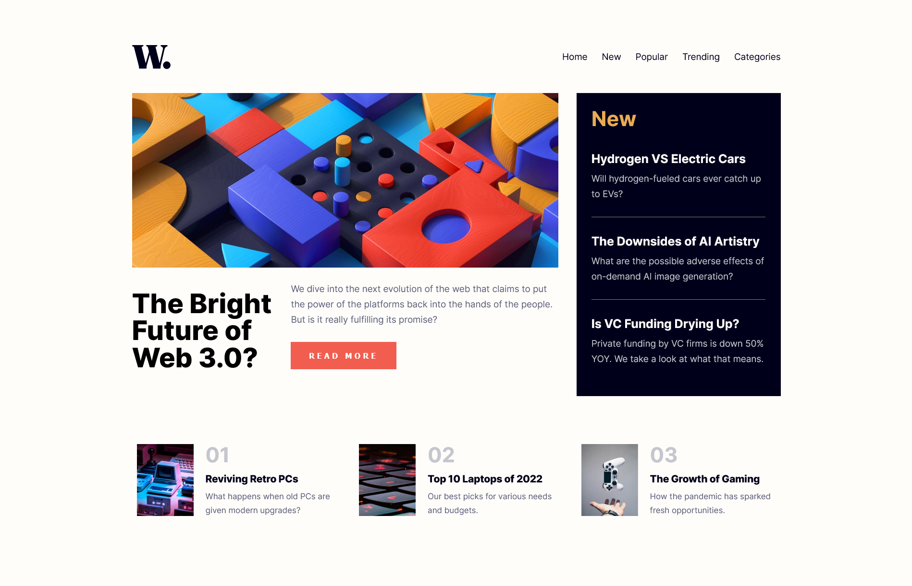

## Table of contents

- [Overview](#overview)
  - [The challenge](#the-challenge)
  - [Screenshot](#screenshot)
  - [Links](#links)
- [My process](#my-process)
  - [Built with](#built-with)
  - [Continued development](#continued-development)
- [Author](#author)

## Overview

### The challenge

Users should be able to:

- View the optimal layout for the interface depending on their device's screen size
- See hover and focus states for all interactive elements on the page
- **Bonus**: Toggle the mobile menu (requires some JavaScript)

### Screenshot

### Links

- Solution URL: [https://github.com/MYasin20/news-homepage]
- Live Site URL: [https://myasin20.github.io/interactive-card-details-form/]

## My process

### Built with

- Semantic HTML5 markup
- Flexbox
- Desktop-first workflow

### Continued development

Expanding my knowledge using media queries

## Author
- Frontend Mentor - [@MYasin20](https://www.frontendmentor.io/profile/MYasin20)
- Github - [@MYasin20](https://github.com/MYasin20)